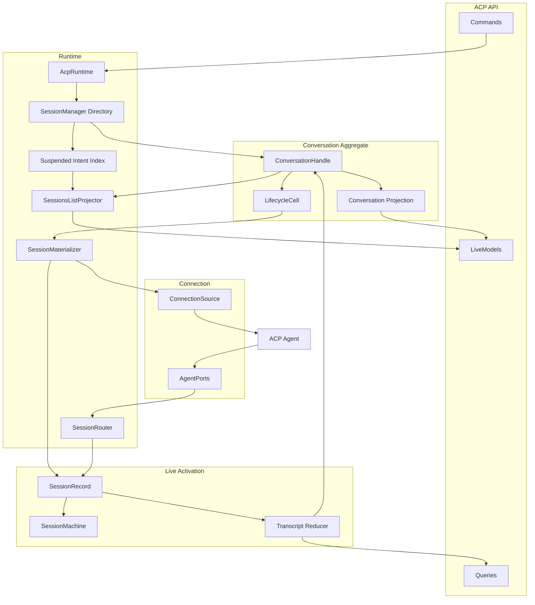

# ACP Runtime Architecture

The ACP runtime is the domain service that serves the ACP API contract. It owns
the host-scoped dependencies needed to run provider ACP sessions, but it should
not mix cross-session routing with per-session state projection.

## Ownership

- `AcpRuntime` is the composition root. It wires the ACP API contract to shared
  ports, the resource-cached connection source, and the session manager.
- `SessionManager` is the conversation directory and cross-conversation coordinator. It owns the
  handle map, suspended-intent index, process-close fan-out, lifecycle-chassis wiring, and the
  composition of the router, materializer, and list projector. Activity tracking, idle sweeping,
  intent persistence, lifecycle reports, and eviction sequencing remain delegated to the shared
  session-lifecycle chassis (`packages/core/src/services/session-lifecycle/`). Its explicit
  `inspect()` seam exposes identifier-only lifecycle snapshots for deterministic ownership and leak
  assertions without revealing the directory maps.
- `ConversationHandle` is the aggregate root for one conversation. It owns the wake descriptor,
  desired configuration, retained presentation snapshot, conversation-lifetime projection,
  explicit lifecycle state and epoch, current `SessionRecord`, activation snapshot construction,
  and its single-key `LifecycleCell`. Descriptor and retained-presentation changes write through one
  intent-persistence seam, while killed/disposed state and the epoch invalidate stale asynchronous
  materialization and command work before directory removal.
- `LifecycleCell` provides coalesced starts, leases, interrupt-before-drain teardown, and bounded
  draining for one handle. The multi-key `LifecycleRegistry` remains available to other runtimes.
- `SessionMaterializer` is stateless. It acquires a connection, loads or creates the provider
  session, creates the record's machine-state binding, applies retained configuration and mode, and
  returns a `SessionRecord` for the handle to adopt. Provisional loading registration and replay
  setup share one cleanup path so failures cannot leave routing residue.
- `SessionRouter` owns ACP `sessionId` routing and one scoped provisional load route per process
  generation. The materializer serializes `loadSession` handshakes for each generation, so a
  provider that reports a rebound session ID still resolves unambiguously. Unknown or stale updates
  outside that scope are dropped rather than retained across activations; generation invalidation
  drops provisional and registered routes. Its maps stay private; identifier-only queries support
  lifecycle leak assertions.
  `SessionsListProjector` composes live handle summaries with lightweight suspended-intent rows.
- `SessionCell` owns one live activation: the state machine, transcript reducer, permission broker,
  prompt queue effects, turn quiescence, and whether the provider's config catalog is pending or
  ready. It does not own the conversation-lifetime projection or retained rematerialization
  descriptor.
- The ACP connection source owns provider processes through `createResourceCache`.
  Cache identity includes provider, cwd, and an opaque fingerprint of the requested environment;
  the process route id stays provider/cwd plus generation and can host multiple ACP sessions with
  the same environment.
- Models under `packages/core/src/acp/models/` are the shared vocabulary for
  reducer output, live model state, and the public ACP API contract.
- Runtime implementation code lives under `packages/core/src/runtimes/acp/node/`; the portable
  contract and client models stay under `packages/core/src/runtimes/acp/api/`.
- The Node surface exports `createAcpComponent()`. App-owned worker entries call
  `runWireComponentWorker(createAcpComponent(...))`; `@emdash/core` does not export
  process bootstrap helpers.

## Command and Read Paths

Commands enter through the API and are routed by `AcpRuntime` to the
`SessionManager`. The manager locates or lazily creates a `ConversationHandle`; wake commands ask
the handle's lifecycle cell to ensure an activation and acquire the appropriate lease. Session
commands then reach the `SessionCell`, where the pure
`SessionMachine` decides whether the command is valid and emits effects for the
cell to interpret.

Provider updates move in the opposite direction. The connection handler receives
ACP callbacks, normalizes raw `SessionUpdate`s through the provider's enrich
hook, and asks the `SessionRouter` to resolve the owning conversation. The cell folds the event
through the reducer; its handle republishes the resulting activation snapshot through the
conversation-keyed projection.

The public API separates session startup from observation. Desktop resolves the authoritative
conversation configuration and provider environment. `attach` creates or refreshes the handle,
publishes its retained projection, and returns the runtime-owned provider session reference without
spawning a provider. After subscribing, the desktop calls `startSession` with `mode: 'resume' | 'fresh'`,
then reads history. The reference returned by attachment selects `fresh` for a never-started
Conversation and `resume` otherwise, even when the desktop's session reference has not converged.
Headless callers use the same `startSession` operation with their trusted descriptor.

`resume` uses the retained session reference; `fresh` skips loading it and uses `session/new`.
Concurrent starts coalesce through the handle's lifecycle cell. A fresh request cannot replace
an already-active session. `loadHistory` only reads available history and reports `unavailable`
while suspended; it does not activate a provider. `sendPrompt` may still wake a suspended session
as part of that explicit command. `setOption` updates the desired model, mode, or effort without
waking a suspended session.

`sendPrompt` (protocol 8) waits for activation and attachment validation, then acknowledges
once the live session accepts the prompt for dispatch or queuing. Its host-owned operation retains
the activation lease until execution finishes; a desktop disconnect does not cancel that work.
Startup/authentication failures are returned before acceptance. Provider failures after acceptance
are published through the existing session and transcript state. Callers that need completion
observe that state; the send acknowledgement no longer means the turn has finished.

The desktop subscribes before submission and refreshes both live snapshots and committed history
after reattachment, even when no active turn was observed before the outage. History reads are
fenced to the current attachment and retried after transient failure; a newly active turn defers
history replacement until its completion. The optimistic row shares the submission's client prompt
id, so history clears only the corresponding row and preserves newer submissions. A client
prompt id follows the existing queue and synthesized user transcript message so a lost acknowledgement
can be reconciled without matching text. Wire marks failures known to occur before posting as
"not-sent", including held-call overflow and cancellation or disposal before posting. This evidence
survives gateway forwarding, allowing the desktop to report rejection and restore the draft.
Failures without that evidence remain uncertain and do not restore or resubmit the prompt.
This is not a durable outbox:
provider-replayed history may lack the correlation id after a worker restart, leaving delivery
explicitly uncertain. No receipt journal or new persistence authority is introduced.
The changed acknowledgement semantics require protocol major 8. Older clients or servers must
upgrade through the existing protocol-incompatibility flow; there is no legacy sending fallback.

The handle persists an explicitly allowlisted, versioned intent containing provider/session
identity, cwd, desired model/mode/effort, and a bounded non-secret presentation snapshot.
An optional `unstarted` marker is affirmative evidence that automatic replacement is safe.
Before loading a saved provider session, the handle durably clears the marker: replay can reveal
history, so a worker crash or a subsequent failed write must leave the old pointer protected.
Only that uninterrupted attempt can use its prior untouched evidence to replace a precisely
identified missing session with no replayed history. Successful empty replay restores eligibility;
interrupted or uncertain replay leaves it disabled. Legacy intents without the marker are never
assumed empty. Before dispatching a prompt, the handle also durably clears the marker.

Provider creation and replay produce provisional state. The runtime writes a proposed pointer,
continuity marker, and retained presentation through the per-conversation FIFO queue before
adopting them or dispatching initial prompts. A failed write leaves the prior identity and
presentation intact. The synchronous commit callback runs before later background writes, whose
payloads are read at execution time so they cannot restore stale state. The file-backed store
likewise publishes its cache only after atomic file replacement; failed mutations cannot leak
into a subsequent write. Configuration and presentation writes use the same persistence queue.
Provider environment, MCP credentials, runtime endpoints, and unknown descriptor fields are never
persisted.
Initial prompt payloads remain in the owning Conversation configuration. Desktop supplies them on
attachment and startup even when a provider pointer exists; the runtime's durable
`initialQueueConsumed` marker decides whether to use them. Legacy intents without this marker are
treated as consumed. Fresh versus resume selects provider-session continuity only; both modes retain
known pending initial prompts, and only the dispatch commit consumes them. A pending queue with no
supplied payload fails explicitly rather than being silently discarded. Saving a provider pointer
does not consume the queue: startup first prepares the entire queue and completes replay/readiness
with prompt effects held, then durably consumes the
queue and protects the session before releasing dispatch. Preparation or persistence failure leaves
the queue retryable, including after worker restart. The dispatch commit is conservative: a crash
after it can leave delivery uncertain and must not automatically resend the initial queue. This
does not make accepted live queues durable or introduce a prompt outbox.
The runtime reports provider session identity and resume outcomes through the host conversation
index. Interactive callers therefore never persist lifecycle response data themselves.

Parsed transcript and raw ACP log exports are live-activation reads. They never wake a suspended
conversation because the raw log is activation-local and a post-wake export would describe the
replay rather than the evicted process.

## Transcript event ownership

The transcript reducer separates foreground content progression from asynchronous tool, agent,
and plan state. `event-routing.ts` resolves a tool's owning turn (including suppressed edit calls)
before opening a turn or materializing content. The owner index survives turn completion and is
reset with the parser on activation/replay. Child calls inherit their parent's owner. Provider
enrichment must preserve whether a specialized tool notification starts or updates a call via
`operation`; changing its presentation kind to `subagent` must not erase this distinction.

Only content transitions and new foreground root invocations close a content segment.
`content-stream.ts` owns both identity and reasoning finalization; `item-fold.ts` applies updates
without inferring content completion from notification arrival. Provider ids are opaque values in
a namespace separate from generated ordinals and roles. Reasoning continuation uses exact ids and
explicit segment ordinals, never prefix matching. Item ids remain deterministic across live and
replayed input, but consumers must treat them as opaque rather than parse their spelling.

Tool updates, plan revisions, and nested activity preserve the foreground stream even when they
materialize new rows. A late tool update amends its original turn and never opens a new agent turn.
SessionCell uses the same foreground classification for idle activity/quiescence. Background tool
rows remain running across foreground turn completion and settle from their own status updates.
The optional session `historyRevision` increments when an already committed turn is amended; the
desktop refreshes history independently of turn completion (deferring replacement while a new
foreground turn is active). Plans remain session-scoped, with their transcript anchor in the turn
that first presented the plan; an idle plan notification alone does not start a turn.

For partial provider replay, an update-only call can be recovered within an existing active turn,
without ending its content. When idle, unmatched tool notifications are retained in a bounded
128-event window until a call start or parent establishes ownership; older unmatched notifications
are evicted. This fallback cannot infer ownership absent provider evidence. No status notification
alone is treated as proof of a new foreground turn.

Committed history, live turns, and pending submissions have separate ownership. The desktop
installs history with `history.replace`, which preserves the independently observed live turn
unless that same turn is now committed; `history.seed` remains an explicit transcript reset. Initial history reads are fenced to the
attachment just like subsequent refreshes. A missing history page never establishes that a
restored conversation is empty. Pending rows reconcile against the matching `promptId` in their
own conversation's active or committed turns, even without a mounted view; switching the view
between conversations never acknowledges or removes a submission.

## Suspension and Rematerialization

The public identity is always `conversationId`; provider process activations are internal. A
retained conversation keeps its wake descriptor and presentation after its live `SessionCell` is
evicted. The presentation separates desired configuration from last-known provider catalogs, MCP
summaries, usage, and observation time. During one runtime generation, its handle and projection
move between `closed`, `suspended`, `materializing`, and `active`; suspended and materializing
projections keep controls visible and prompt submission enabled while clearing activation-local
queues, permissions, terminals, active turns, plans, and agents.

While a rematerialized session's provider config catalog is pending, the handle projects the
retained catalog to avoid transiently removing its controls. A ready catalog atomically replaces
all retained model, effort, mode, and collaboration-mode groups; explicit empty or unsupported
groups are authoritative and must not fall back to retained values. Successful `newSession` and
`loadSession` handshakes end the pending phase; omitted or null config options produce a ready empty
catalog. Available commands have a separate readiness lifecycle and are retained independently
while materialization is pending.

On worker boot, every valid persisted intent is restored only as a lightweight suspended index row;
the worker never starts a provider from disk. The first desktop `attach` hydrates a handle using a
trusted fresh descriptor and publishes the retained presentation. Terminating an index-only entry
deletes its intent without starting a provider. Legacy or over-broad intents are parsed through a
restricted migration and rewritten in the safe schema.

`startSession` and `sendPrompt` materialize a suspended activation.
Mode, model, and effort changes update desired state and persist without waking when suspended or
materializing; the latest revision is applied after load and before the first queued prompt. Other
reads, exports, callbacks, cancellation, permission resolution, and queued-prompt edits never wake
one. Restoration always tries the saved provider session first. Only a provider-confirmed missing
session whose persisted `unstarted` marker remains true may fall back to `newSession`, within the
same conversation. Partial replay revokes that permission before a failure is returned. Other
failed or unsupported loads preserve the saved pointer. A missing session with unknown or used
history returns `session_not_found`; the desktop offers both explicit retry (after correcting the
provider context) and a fresh bootstrap of the same Conversation. Both use the same `startSession`
operation, choosing `resume` for retry or `fresh` for explicit replacement. A fresh replacement
retains the draft and desired configuration and never replays the previous initial prompt. Initial
queued prompts are still delivered on the first fresh start of a new Conversation. The old pointer
remains intact if creation fails, and a successful replacement is persisted before startup succeeds.
Lifecycle reports publish the replacement through the existing Conversation index. There is no
session-id failure cache.
An unavailable history page is not proof of an empty conversation; callers retain existing
transcripts, and first loads with unknown history expose an error instead of the new-chat state.
Provider restoration errors require explicit
retry. Provisional replay revisions are not committed history changes and do not schedule history
refresh. A failed restoration also clears refresh requests queued during that attempt. Transient
history-read failures receive at most five retries with exponential backoff capped at 15 seconds,
then expose an explicit retry action while retaining the transcript.

Provider replay reconstructs committed history internally. While the session is replaying, its
public projection exposes no active turn, so partial historical messages cannot briefly enter and
leave the live renderer. A successful load publishes any rebound provider session identity; a
failed or unsupported load preserves the original identity unless the untouched-session exception
above applies. Failures log the original serialized exception.

Unsupported saved selections are removed only after replay finalization, initial prompt queuing,
and route registration succeed. Until then, desired settings remain intact in memory and in the
saved intent so a failed restoration can retry them. Removal applies only to the validated value;
a newer user selection must survive. Supported settings still reach the provider before queued
prompts start.

Provider close acknowledgement is part of teardown. The conversation retains a pending close
across the bounded teardown timeout; subsequent activation must await it or return a recovery
error. A rejected close can be retried, while an outstanding close is never duplicated. If the
provider connection generation has gone away, the old close no longer blocks restoration on a
new connection. Cancellation still starts promptly before waiting for closure and lease drainage.

Materialization is server-side and coalesced by the handle's lifecycle cell. A prompt submitted
while materializing joins that activation and dispatches once after the latest desired configuration
has been applied. Active mode and config changes use shorter leases. Eviction, termination, and runtime
disposal abort pending materialization and interrupt the cell and provider session before waiting
for leases, then continue after a bounded drain timeout if a provider does not settle. Process-close
callbacks carry a connection generation so a stale process cannot suspend sessions on its
replacement.

Provider close acknowledgement is part of teardown. The conversation handle retains a close barrier
across a bounded timeout; subsequent activation attempts must wait for that same close, retry a
rejected close, or establish that its connection generation no longer exists. A timeout alone never
permits reuse of the closing session. Cancellation still starts before lease draining. Restoration
logs include conversation/session identity and a bounded, redacted JSON-RPC explanation when the
provider puts it in error data rather than the generic error message.

## Process Hosting

Desktop-local ACP and workspace-server ACP both register logical workers through
`WireWorkerHost` and use the Node `childProcessSpawner()` by default. The child
process entry calls `runWireComponentWorker(createAcpComponent(...))`, which constructs
`AcpRuntime`, a machine-scoped `AgentPluginHost`, and `ChildAcpProcessHost`.
Attachment operations come from the injected conversations runtime. Host executable resolution comes
from the injected `HostDependencies` resolver contract; ACP does not construct a dependency manager or
keep a runtime-local executable cache. ACP-specific resources such as process handles, ACP ports,
terminal management, and session cells stay inside the ACP runtime. Each host
owns a worker manifest that maps the ACP worker id to the emitted child-process entry path for that
host's build.

The conversations runtime owns attachment storage for ACP and TUI; the workspace registry owns
shell uploads. Both use the shared attachment store under the host's attachment root (currently
named `acp-attachments`). Each owner kind has one store instance in its sole writer worker.
Conversation and workspace workers share that root but own disjoint namespaces.

An attachment is a directory at `<conversations|workspaces>/<owner-id>/<attachment-id>/` containing
`metadata.json` and `content` with a sanitized extension. The store writes metadata and streams bytes
into a private directory under `.staging/<owner-kind>/`, closes the files, then publishes the whole
directory with one rename on the same filesystem. There is no separate authoritative index to commit.
Reads validate the attachment id and metadata, derive the content path, and stream bytes from disk.

At worker startup, the store removes abandoned staging only within that worker's owner-kind namespace.
All operations await the same initialization promise, so cleanup cannot race new uploads or run again
while they are active. A process exit before publication leaves reclaimable staging; an exit after
publication leaves complete, addressable metadata and bytes. This guarantees atomic visibility across
worker exits, not power-loss durability. A crash after publication but before the response may leave
an unused committed attachment, retained until explicit deletion or owner deletion.

Desktop draft mementos may reference attachment bytes that do not appear in a transcript. Published
attachments therefore have no age-based or transcript-based expiry. Owner deletion performs best-effort
cleanup, serialized against publication; workspace deactivation retains attachments. The earlier
development layout with an owner-wide index is not read or migrated; its published bytes are left
untouched until owner deletion. Existing development attachments must be uploaded again to retrieve
them through the attachment APIs after upgrading.

Desktop composes the ACP client and renderer exposure in
`apps/emdash-desktop/src/main/gateway/desktop-workers.ts`. The raw stable worker client is consumed
by typed desktop Wire controllers and by headless runtime services; renderer clients receive the
smaller conversations contract. `WireWorkerHost` itself does not own client decoration, startup
policy, or renderer exposure.

The concrete plugin registry is injected by each host entry (`emdash-desktop` and
`workspace-server`) rather than imported by `@emdash/core/runtimes`; this keeps runtime
from depending back on `@emdash/plugins` while still letting plugin resolution be
owned by the runtime composition root.

Desktop relies on Electron's `child_process.fork` behavior, which runs children
with `ELECTRON_RUN_AS_NODE`. The packaged app must keep the `RunAsNode` fuse
enabled while this fork model is used. If the app later disables that fuse for
macOS hardening, the wire package exposes the Electron
`utilityProcessSpawner()` seam for utility-process generations.

ACP terminal callbacks execute as client-hosted sibling processes rather than operating-system
children of the provider process. Their environment therefore starts from the provider process's
resolved spawn environment, then applies command-specific variables from the ACP request.

## Models and Protocol Versioning

The ACP API contract should reference the schemas in `packages/core/src/acp/models/`
instead of maintaining duplicate workspace-server schemas. This means wire-facing
model changes are protocol changes. Follow the workspace-server compatibility
rules:

- Add optional fields for backward-compatible minor changes.
- Treat required field changes, removals, renames, and incompatible union changes
  as major protocol changes.
- Keep wire envelopes such as history pages, terminal output stream events, and
  runtime errors in the ACP API layer because they are transport framing, not
  domain models.

Protocol 11 replaces `launch` with `startSession` and its required `resume`/`fresh` mode, returns
the current provider reference from attachment, makes history reads non-waking, and adds the
`session_not_found` error variant. TUI also renames `start` to `startSession` to use the same
operation name. These are breaking changes, including a closed error-union change for older clients.
ACP resource-not-found errors must identify the requested session; provider-specific evidence (such
as Codex's missing-rollout response wrapped in
`-32603`) is recognized by the plugin's `isSessionNotFound` hook. Generic internal errors and missing
files are not evidence that conversation history is gone.
