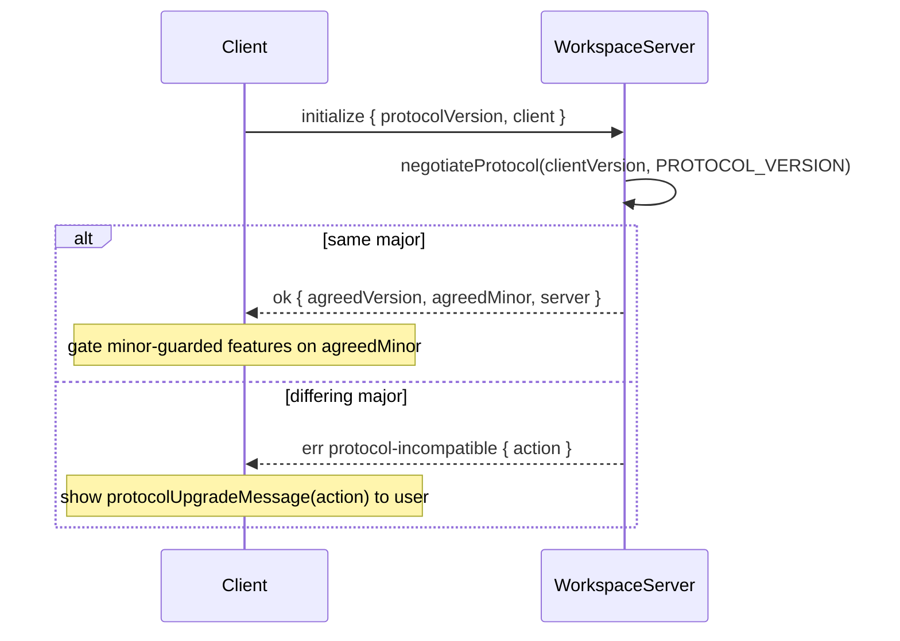

# Workspace Server

The Workspace Server (`apps/workspace-server/`) is a Node daemon that runs on a remote machine and exposes workspace runtimes (git, files, deps, ACP, …) to Emdash clients over the `@emdash/wire` protocol. Clients connect over an SSH-forwarded Unix socket; the daemon is independently lived and can be running when clients upgrade, downgrade, or are absent entirely.

The desktop client and managed installation flow live in
`apps/emdash-desktop/src/core/services/hosts/node/workspace-server/`. For an SSH host, the runtime
broker looks up a `HostService` through `Hosts` (`core/services/hosts/node/hosts.ts`) and asks
its `runtime` service for a client. `Hosts` owns identity replacement, aggregate state/events,
and lease rebinding. Each remote identity has one `HostService`
(`node/host-service.ts`), composing `connection`, `runtime`, and `server`. Server operations
are bound to that Host, with their own provisioning caches and operation queue. Retired identities
cannot publish into replacement state. Local workers remain owned by desktop runtime bootstrap.
`host.server` implements the `HostWorkspaceServer` interface directly through
`RemoteHostWorkspaceServer` (`node/remote-host-workspace-server.ts`). Its public methods take no
connection ID; its owner supplies the identity once. It owns the observable daemon state, one
operation queue, and one latest-version cache. Disposing its owner clears its observed state and
cancels active and queued operations.
The Host service coordinates the
per-Host `HostConnectionSupervisor` (ADR 0008), bounded SSH adapters, and workspace-server
provisioning. `ManagedHostConnection` owns leases, the runtime pin, and serialized persisted intent.
Its composed supervisor owns execution, health-check scheduling, and retry policy.
Its internal `HostRuntimeConnection` owns the stable Wire client, bounded channel opening and
initialization, candidate installation/cleanup, and physical-generation-bound health requests.
It reports disconnections and RPC timeouts to the supervisor without scheduling recovery.
Provisioning uses a one-shot
`WorkspaceServerDialer`; neither it nor the SSH manager schedules connection recovery. The broker
only resolves clients. Ordinary outages preserve logical identity; machine identity edits dispose it.

The public `HostConnection` port exposes read-only availability, `lease(owner)`, `pin()`, and
`disconnect()`. Pin and Disconnect return typed Results about intent registration/persistence;
they do not wait for connection establishment. Internal readiness and wake operations are separate.
Projects own a child-scope connection lease while automatic access is eligible, and dispose that
scope when access becomes ineligible. Observing state registers no intent; there is no demand-mode API.
`Hosts.lease(connectionId, owner)` follows identity replacement while its owner remains alive;
`host.connection.lease(owner)` belongs to that particular Host identity. Passive project observation
registers no lease. SSH-only access
remains independent of runtime pinning; restoring persisted SSH permission does not create a pin.
Availability is a kernel-derived projection, with a stable per-Host source that follows identity
replacement. Readiness waits require existing explicit runtime intent or scope-owned automatic
demand; they never acquire implicit demand. `host.runtime.waitUntilReady()` only observes;
explicit Connect/Retry registers a pin before waiting, capturing the same Host identity across both
steps. Wake hints go through `Hosts`, not runtime access. Health deadlines do not slide when serving
those waits.
Explicit server operations capture the supervisor's operation scope before queueing, so Disconnect
or identity replacement cancels both queued and active work. Failed/timed-out operations expose
manual recovery; successful Stop remains paused until an explicit runtime action.

`node/availability.ts` routes local/remote availability and exposes the shared Wire live model.
It owns no retry loop. `node/worker-host-availability.ts` owns readiness for adapter-managed
workers; production uses it only for desktop-local workers. A remote Host cannot fall back to
that local preparation path. The Host probe and provisioner each own a single Host's cached result
and current operation; cancelled work is fenced before continuing to another daemon action.

Managed Linux installations use `~/.emdash/workspace-server/` with immutable version directories,
an atomic `current` symlink, staging and install-lock paths, and an explicitly selected socket under
`run/`. When the daemon is absent or the user explicitly requests an update, the desktop downloads
the channel pointer for its protocol major, then downloads and executes that version's immutable
`apps/workspace-server/install.sh` on the remote with the selected version pinned. Canary desktops
fall back to the stable pointer when no canary pointer exists. The script detects Linux architecture
and glibc support, pulls the matching artifact, verifies its SHA-256 sidecar, and extracts it before
`current` changes. Compatible same-major daemons remain installed until a future explicit update.
The desktop offers that update only when the channel pointer names a strictly newer SemVer artifact
version; equal and older pointer versions leave the running daemon alone.
`EMDASH_WORKSPACE_SERVER_ARTIFACTS_URL` overrides the install-script and artifact base URL for
development; the Docker remote dev setup publishes Linux builds to local minio and uses
`http://minio:9000/emdash-releases/workspace-server` so remote installation exercises the same
curl-based object-store path as production. Provisioning verifies that every successful install
selected the exact version named by the resolved channel pointer.

The contract lives in `packages/core/src/workspace-server/`, shared by the server and every client so TypeScript clients stay in sync at build time. Non-TypeScript clients (e.g. a future mobile app) use the negotiation handshake at runtime — compile-time sharing is a convenience, not the contract.

The daemon is the Electron-free equivalent of the desktop runtime host. Every core runtime is a
required supervised child worker in both socket and stdio modes: ACP, agent config, automations,
conversations, file search, files, Git, host settings, resource usage, scripts, terminals, TUI
agents, and workspace registry. The filesystem watcher is also a worker because it is the shared
dependency for files, Git, file search, and the workspace registry. The workspace registry depends
on host settings and scripts: it owns the reactive project-config model, resolves lifecycle
commands and shell setup, and sends strict execution inputs to scripts. Automations starts last and
depends on the workspace registry: automation workspace activation flows through the registry's
`createWorkspace` and `activateWorkspace` verbs. Server startup fails if any required worker cannot
become ready; there are no unavailable-domain fallback implementations in the aggregate controller.

Interactive TUI processes do not expire after an hour of silence. The worker and runtime use
the `always` lifecycle policy; explicit stop/delete and workspace teardown still release them.
Closing an output view only detaches that view. Activation uses the host's idempotent start/resume
path to reattach a surviving process or restore a lost process through its provider resume handle.
Ordinary transport recovery preserves the output cursor. A replacement process starts a fresh
output generation and terminal display; exact scrollback across process restarts is not promised.
Output sources remain stable while subscribed, including through explicit runtime eviction, and
unobserved evicted sources are released. A stopped process retains its bounded output until resume
or deletion. Late output from a disposed PTY cannot contaminate its replacement's output.

The parent mounts each complete runtime contract under `workspaceWireContract`. Aggregate
forwarding rebinds live endpoint definitions to their namespaced contract ids while retaining the
standalone worker client's upstream topic handles, and translates mutation cursor model ids to the
same aggregate namespace. Runtime-owned persistence lives below the workspace-server state
directory, including automation and file-search databases, session intents, ACP attachments, and
other runtime state. Repository and worktree placement is desktop-owned; the server reports its
structured home path and filesystem `PathProfile` through the files runtime and executes plans
containing absolute paths. The profile is optional on the wire so current clients remain compatible
with older same-major servers. Managed remote Windows hosts are rejected as unsupported before the
POSIX home, layout, installer, or daemon paths run.

Host dependencies are mounted under `workspaceWireContract.hostDependencies`.
The daemon parent owns one local `HostDependencies` component backed by a JSON-file
`KeyValueStore` under the workspace-server state directory and forwards only the narrow resolver
contract into process-spawning child runtimes. The full contract remains available to clients for
inspection, refresh, explicit PATH selection, and plugin-declared update commands. This keeps
workspace-server dependency state local to the remote host while preserving the same source and
selection model used by the desktop SQLite-backed component.

Port-forward inspection is mounted under `workspaceWireContract.portForwards`.
The daemon probes its own loopback interfaces and reports whether a requested
port is accepting connections on IPv4, IPv6, or both. Desktop clients can use
this as the wire control plane before opening a transport-native data stream for
preview traffic.

## Protocol Version

The wire contract is versioned with a single [semver](https://semver.org) string, defined in
[`packages/core/src/workspace-server/versions/index.ts`](../../packages/core/src/workspace-server/versions/index.ts):

```ts
export const PROTOCOL_VERSION = '9.1.0';
```

### What each component means

| Component | Meaning | Compatibility |
|-----------|---------|---------------|
| **major** | Breaking wire change — removed or retyped field, changed procedure name, changed framing | Incompatible across differing majors |
| **minor** | Additive, backward-compatible — new procedure, new optional field, new ignorable event kind | Compatible; negotiated feature level is `min(clientMinor, serverMinor)` |
| **patch** | No wire impact — bugfix, performance, internal refactor | Always compatible; informational only, ignored by negotiation |

**Compatibility rule**: same major implies compatible. On a major mismatch, the lower major is the stale side and determines the upgrade prompt.

## Behavior-Change and Versioning Rules

### When to bump minor (additive, non-breaking)

- Adding a new procedure.
- Adding an optional field to an existing request or response schema (must be `.optional()` or carry a default; never add a required field in a minor bump).
- Adding a new event kind to an event iterator output where old clients can safely ignore the unknown kind.
- Introducing opt-in behavior that is gated on `agreedMinor >= N` — the client checks `agreedMinor` and falls back gracefully when the server doesn't offer it.

### When to bump major (breaking)

- Removing or renaming a field, procedure, or error variant.
- Changing the type or semantics of an existing field.
- Changing how requests are framed or how errors are encoded on the wire.
- Adding an event kind that old clients **must** handle (rather than ignore).

### When to bump patch (no wire change)

- Fixing a bug that does not alter observable wire behavior.
- Internal performance or correctness improvements.

### Never do these

- Silently change the semantics of an existing call at the same version.
- Add a required field to an existing schema in a minor bump.
- Repurpose an existing field for a different meaning — add a new field and deprecate the old one.
- Remove a field or procedure without a major bump and a deprecation window.

### Discriminated unions

The contract uses many discriminated unions (e.g. `GitPathInspection`, `GitStatusModel`, error unions). Adding a new variant is a **minor bump only if** old clients can safely ignore unknown variants with a default/fallback branch. If the client must handle the new variant to function correctly, it is a **major bump**.

### Schema parsing and unknown fields

Zod strips unknown keys on `.parse()` by default. This is the correct behavior for a tolerant reader: an old client receiving a new response silently ignores new fields. Do not rely on parse to preserve unknown fields if the value is forwarded elsewhere.

## Initialize Handshake

Every client must call `initialize` before using a new connection for workspace operations. `health`
is the only pre-initialization exception because daemon lifecycle probes use it to distinguish an
absent daemon from an incompatible one. Because the daemon is independently lived, `initialize`
must be re-called on every reconnect: the daemon may have changed versions between connections.

The Host supervisor treats initialization as a readiness barrier. A candidate stream is not
installed and live topics are not reattached until its `initialize` call succeeds. Remote calls
are not held for later delivery while disconnected. A protocol incompatibility blocks automatic
recovery and requires an explicit update; ordinary I/O failures retry with capped jittered backoff.
Resume/focus/online and periodic correlated Wire health checks validate existing evidence instead
of trusting a retained client object. Healthy SSH alone does not establish runtime usability.

### Request (client → server)

```ts
{
  protocolVersion: string;  // the client's PROTOCOL_VERSION
  client: {
    id: string;             // stable client identity for operation attribution
    appVersion: string;
  };
}
```

### Response (server → client)

```ts
{
  protocolVersion: string;  // the server's own PROTOCOL_VERSION
  agreedVersion: string;    // major.min(clientMinor, serverMinor).0
  agreedMinor: number;      // clients gate minor-guarded features on this
  server: {
    appVersion: string;
    daemonId: string;       // stable per-process identity, set at startup
    startedAt: number;      // Unix ms when the daemon started
  };
}
```

### Failure: protocol-incompatible

When majors differ, the fallible `initialize` procedure returns a typed error:

```ts
{
  type: 'protocol-incompatible';
  action: 'upgrade-client' | 'upgrade-server';
  clientProtocolVersion: string;
  serverProtocolVersion: string;
}
```

`action` is `'upgrade-client'` when the client major is lower (stale desktop app) and `'upgrade-server'` when the client major is higher (stale daemon). Use `protocolUpgradeMessage(action)` from `@emdash/core/workspace-server` to produce a consistent user-facing string.

### Negotiation flow



### Gating a minor-guarded feature (example)

```ts
// Server introduces a new subscribe feature at protocol 1.1.0.
// Clients with agreedMinor >= 1 may call it; others fall back to polling.
const session = await connect(client);
if (session.agreedMinor >= 1) {
  // use git.worktree.subscribe
} else {
  // fall back to polling
}
```

The desktop forwards the read-only agent hook-status procedure to the selected host's
`agent-config` runtime. Local and remote runtimes expose the same procedure from the same build.

## Key Files

| Path | Role |
|------|------|
| [`packages/core/src/workspace-server/versions/index.ts`](../../packages/core/src/workspace-server/versions/index.ts) | `PROTOCOL_VERSION`, `negotiateProtocol`, `protocolUpgradeMessage` |
| [`packages/core/src/workspace-server/releases.ts`](../../packages/core/src/workspace-server/releases.ts) | Release channels, pointer schema, strict artifact versions, and pointer paths |
| [`packages/core/src/workspace-server/wire/schemas.ts`](../../packages/core/src/workspace-server/wire/schemas.ts) | initialize/health schemas |
| [`packages/core/src/workspace-server/wire/contract.ts`](../../packages/core/src/workspace-server/wire/contract.ts) | aggregate control-plane and core-runtime wire contract |
| [`packages/core/src/workspace-server/port-forwards/contract.ts`](../../packages/core/src/workspace-server/port-forwards/contract.ts) | daemon-local preview port inspection contract |
| [`apps/workspace-server/src/api/controller.ts`](../../apps/workspace-server/src/api/controller.ts) | Server-side procedure and live-model handlers |
| [`apps/workspace-server/src/gateway/workspace-workers.ts`](../../apps/workspace-server/src/gateway/workspace-workers.ts) | required worker graph, runtime configuration, and dependency composition |
| [`apps/workspace-server/src/gateway/worker-manifest.ts`](../../apps/workspace-server/src/gateway/worker-manifest.ts) | shared Core and app-local packaged subprocess entries |
| [`apps/workspace-server/src/gateway/worker-paths.ts`](../../apps/workspace-server/src/gateway/worker-paths.ts) | packaged worker executable path resolution |
| [`apps/workspace-server/src/gateway/entries/`](../../apps/workspace-server/src/gateway/entries/) | plugin-injecting ACP, agent config, and TUI-agent worker entries |
| [`apps/workspace-server/src/index.ts`](../../apps/workspace-server/src/index.ts) | CLI and daemon entry point |
| [`apps/emdash-desktop/src/core/services/hosts/`](../../apps/emdash-desktop/src/core/services/hosts/) | Desktop orchestration and lifecycle policy for SSH hosts |
| [`apps/emdash-desktop/src/core/services/hosts/node/workspace-server/`](../../apps/emdash-desktop/src/core/services/hosts/node/workspace-server/) | Wire connection manager, hosted-script installer, daemon control, and provisioner |
| [`apps/workspace-server/install.sh`](../../apps/workspace-server/install.sh) | Remote platform detection and atomic pinned-artifact installation |
