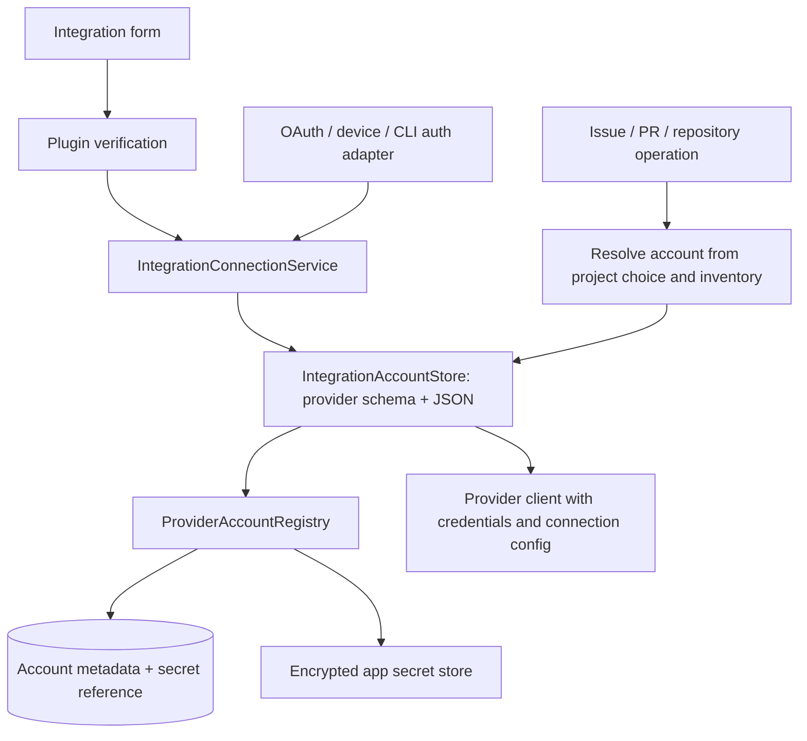

# Integration And Issue Plugins

Integration plugins in `packages/plugins/src/integrations/` own service metadata, auth
method descriptors, credential schemas, and credential verification. Issue plugins in
`packages/plugins/src/issues/` reference an integration by `integrationId` and own issue
operations. GitHub follows the same plugin contracts as the other integrations.

## Authentication Contract

`capabilities.auth` is a serializable descriptor for connection UI: form fields, OAuth,
device flow, CLI import, and whether an account label is required. Executable code belongs
in `behavior.auth`, which must register both:

- `credentialsSchema`: the provider's Zod parser for its JSON credential payload. Use the
  same schema in the provider's client factory and verifier. Parsing is local validation
  and normalization; it does not prove that a credential is accepted by the remote API.
- `verify`: checks credentials against the provider and returns canonical credentials on
  success, together with optional stable account identity and display metadata. Persist
  the returned credentials, never fall back to the submitted form values.

Credentials include connection configuration needed to create a client, such as GitHub's
`apiBaseUrl`, Jira's `siteUrl`, or Plane's workspace slug. The schema remains backend-only;
it is not embedded in the renderer descriptor. Register schemas for every integration,
including GitHub. GitHub additionally exposes its credential schema and TypeScript type
through `@emdash/plugins/integrations/github` for GitHub-specific client consumers.

## Identity And Host Ownership

`VerifiedAccountIdentity.id` identifies the provider account within `scope`; the desktop
currently falls back to `host`, then integration ID, when no explicit scope is supplied.
Preserve existing identity keys when changing schemas. `login`, avatar, and display names
are optional presentation data. Do not invent a login from a display name, workspace name,
or ID. Providers without a stable remote identity may omit `account`; the desktop owns
their local account ID and user label.

The desktop owns account selection, deduplication, project preferences, persistence,
secret references, and credential-format migrations. Public host interfaces live in
`apps/emdash-desktop/src/core/features/integrations/api/node/integration-accounts.ts`:
credential consumers use `IntegrationAccountReader`; authentication adapters complete
verified connections through `IntegrationConnections`.

`IntegrationConnectionService` verifies submitted credentials through the plugin, then
uses the same completion path as trusted OAuth, device-flow, and CLI authentication
adapters. That path owns identity matching, reconnect checks, labels, and persistence.
GitHub's authentication adapters translate their verified identity and credentials into
this contract; they do not write account records themselves. Migration-only imports use
the durable import mechanism so completion and legacy-source cleanup remain retryable.

`IntegrationAccountStore` validates credentials with the registered provider schema on
both reads and writes. It stores the normalized record as JSON through
`ProviderAccountRegistry`. The registry owns account rows, defaults, and opaque secret
references. Its secret-store interface is still string-based: the string is the JSON
document, encrypted by the app secret backend. Account metadata contains no token.

At service startup, `migrateGitHubJsonCredentials` wraps existing raw GitHub tokens as
`{ accessToken, apiBaseUrl }` before account consumers become available. The migration is
offline and idempotent, retains account IDs/defaults/metadata/secret references, and can
retry failed writes. It never interprets an existing JSON document as a token. The older
single-token GitHub importer also writes the JSON representation.

The integrations Wire API separates `listProviders` (available providers described by
`IntegrationProviderDescriptor`, including auth methods and `issueCapabilities`) from
`listAccounts` (saved account summaries grouped by provider ID). Account inventory does
not verify credentials; live connection checks belong to a separate operation.

The renderer observes one account query via `useAccounts()`, `useAccounts(providerId)`,
or `useAccounts(providerId, typeGuard)`. Provider authentication actions are separate
from account inventory; there is no GitHub-specific account query/cache.

The integrations event stream owns `accounts-changed` notifications for successful
connections, reconnects, removals, default changes, and startup reconciliation. The
renderer refreshes shared account inventory and dependent issue queries through
`useIntegrationAccountEvents`, including after a stream gap. GitHub events carry only
authentication progress and notifications. `IntegrationConnectionService` is the sole
owner of `integration_connected` telemetry; authentication adapters do not count the
same connection again.

Project account selection has one provider-parameterized seam: `useProjectAccount` in
browser consumers and `ProjectIntegrationAccountResolver` in node consumers share
`resolveProjectAccount`. Callers identify the provider and choose an explicit repository
context: project context uses the effective base remote; resource context uses the supplied
repository URL. Non-repository integrations omit that context and infer the provider default.
Pins and explicit disable remain fail-closed, and resolutions include the inventory and
account-context key they observed. Git/placement `EffectiveSettings` contains no account
fields and does not load account inventory; worktree previews remain available while
accounts are loading or unavailable.

Account presentation uses `ProviderAccountLabel` and the concrete-account picker
`ProviderAccountSelect` from the provider-accounts browser primitives. They consume
`ProviderAccountSummary` display fields; callers supply the provider name and icon.
The registry assigns a persistent fallback name such as `Account 1` when an account has
no user label, provider display name, or login. It fills missing names on legacy reads
and assigns new names in the account-write transaction. Reconnects retain those names;
real display metadata takes precedence, and sorting or default changes never renumber them.
`createRequiredProviderAccountSelectState` supplies default-first selection for forms
that require an account. Project settings keep their explicit-disable, reset, and
unavailable-pin policy in the shared project account resolver.

The shared `identityStripView` derives account override, resolved identity, and unavailable
states for any provider. `ProviderIdentityStrip` renders that state, account selection,
provenance, and remember-account controls using generic account summaries. Callers supply
the provider name/icon and workflow wording, and own action blocking and persistence.
Project preferences are written through `ProjectSettingsStore.save`.
Create PR blocks submission until its selected account is saved successfully; Add Remote
passes its per-action account explicitly even if remembering the preference fails.

Every connection entry point opens `integrationSetupModal`. It renders the plugin's
declared form fields or a provider-owned auth UI contribution registered in
`src/core/manifests/browser/integration-auth-contributions.ts`. GitHub contributes its
OAuth, device-flow, and CLI acquisition UI through this seam. Those mechanisms remain
provider-specific; successful authentication enters the common connection service.
Reconnect availability follows the supported auth methods and contribution capabilities.
Project account selectors share the same inventory and repository-host matching policy
for repository-scoped integrations.

Issue behaviors receive only `{ credentials, log }` through
`ConnectedIntegrationHostContext`. The desktop resolves the account before invoking the
plugin and attaches account/source identity to results outside the plugin. A verified
identity identifies a connection; it does not establish repository compatibility or API
authorization for every operation.

All issue providers, including GitHub, are assembled with `createPluginIssueProvider`.
Repository-scoped plugins declare `requiredInputs: ['repositoryUrl']`. The desktop
normalizes complete repository URLs and SSH remotes, then uses their host for common
account inference. Hostless shorthand such as `owner/repo` is rejected before credential
access; callers must resolve it using explicit repository context. The provider client
validates the resource against its credential endpoint before requests. Project
disable/dangling-pin states and stale account-context checks fail closed. A linked issue
retains its captured source account when the project's preferred account changes.

Other GitHub features first select an account through the shared resolution policy.
Repository operations resolve against the common inventory; PR and Git operations use
the shared project/operation resolution described above. They then call
`readGitHubCredentials(accountId, expectedHost)`, created by `createGitHubCredentialReader`,
to read typed credentials from `IntegrationAccountReader` and validate the endpoint.
The reader requires an explicit account ID and never infers or switches accounts.
A missing/unusable record fails closed; an exact-ID metadata lookup distinguishes a
removed account from missing credentials. Repository operations read hosts from account
metadata, never from the account ID. Octokit construction and PR-worker auth use the
stored `apiBaseUrl`; Git's credential sink extracts the token from the same credentials.

Repository creation carries the selected provider/account reference into the clone job.
Local HTTPS clone credential channels bind to that exact account, including when it was
initially inferred; later default changes never switch an in-flight clone's identity.
Removal or a host mismatch fails closed. Project-session channels continue to resolve
the current project choice for each request. Remote-host and SSH clones retain native
Git authentication because the desktop credential channel is local-only.

New project registration accepts an `initialIntegrationAccounts` map and commits it in
the same desktop transaction as the Project and Repository association. A settings-write
failure rolls back registration and surfaces as a creation failure; there is no separate
best-effort renderer save that can lose the intended account pin.
